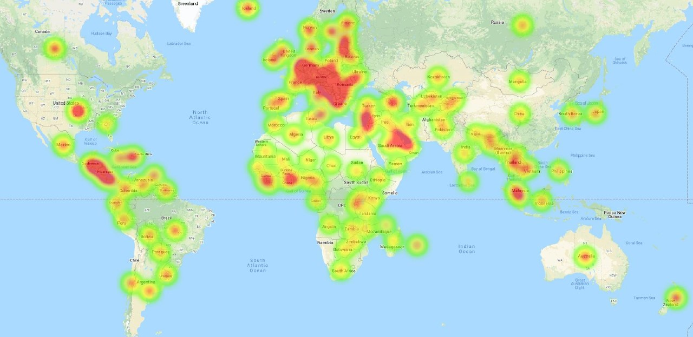
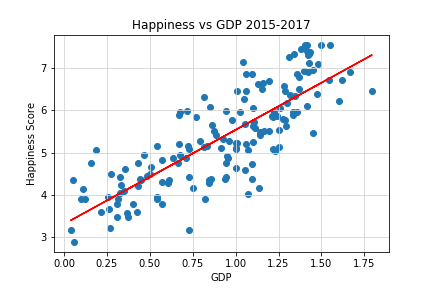
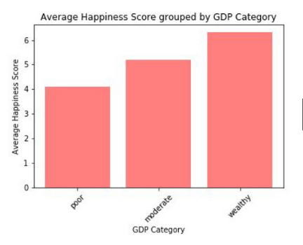
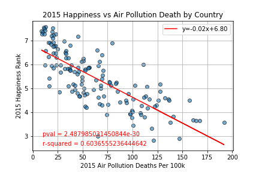
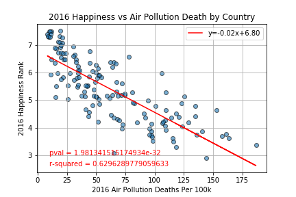
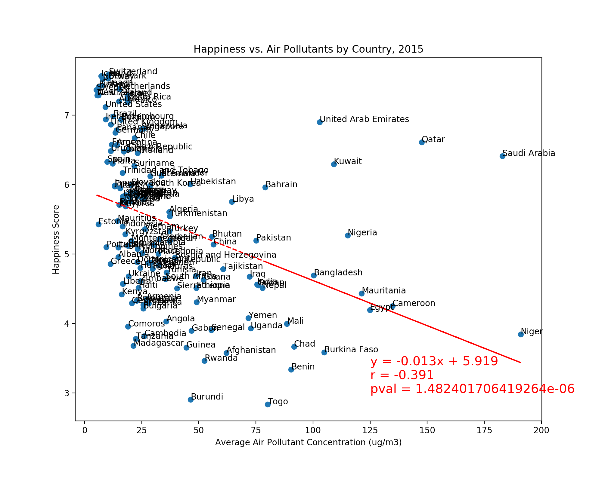
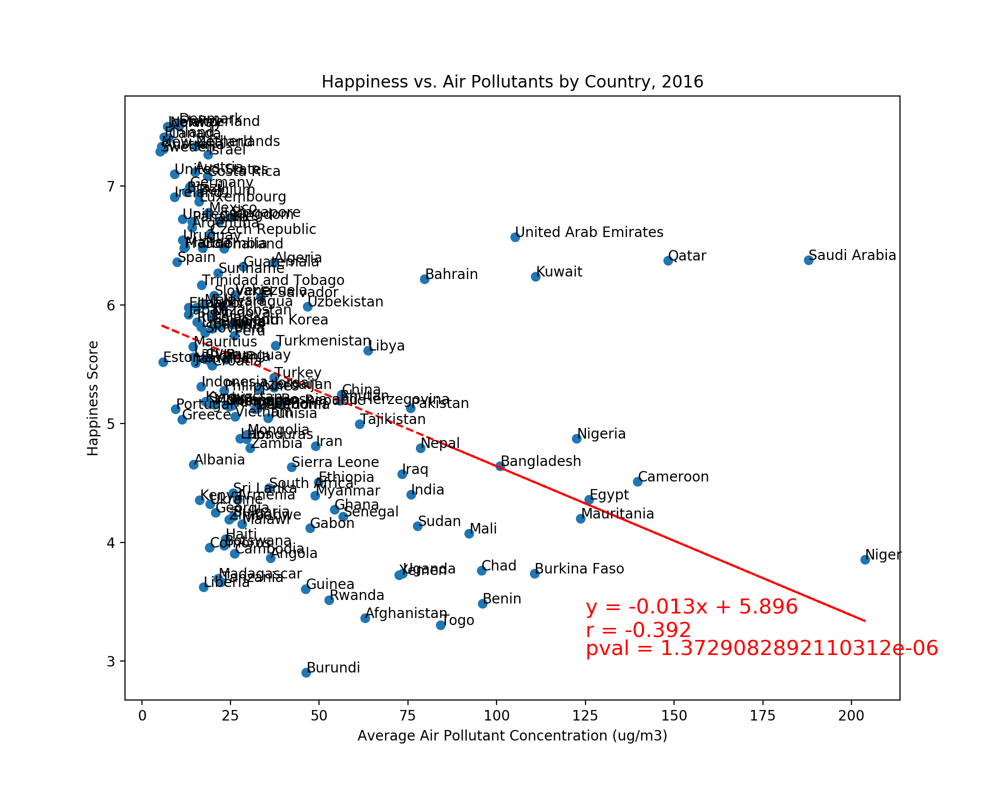
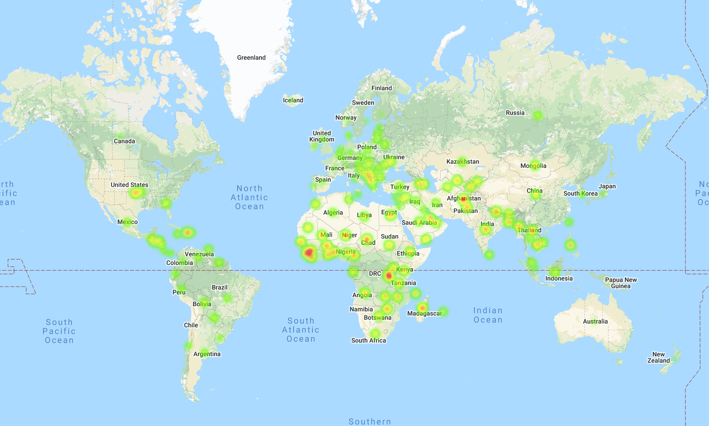

# What Affects Happiness? It's In The Data!
### Written by Jay Sueno, Elisa Gipe, Jason Gabunilas, Patrick Plaisted, Ryan Little
_Technologies: Python, Matplotlib, Jupyter Notebook, Pandas, Git, SciPy Stats, Gmaps (Google Maps API), Powerpoint, Excel_
_Team members used github for file version-control_

The pursuit of happiness is a common human interest. Though it is fairly easy to comprehendwhat happiness is, it is often difficult to define why we experience it. In this investigation webreak down national Happiness Scores from the World Happiness Report from the calendaryears 2015 through 2017 and compare it to a variety of metrics, including but not limited to GDP, life expectancy, perception of freedom, and degree of air pollution. We look at data from several sources over the span of 2015-2017.

For the full report please view the PDFs above - [Team-Presentation-Happiness.pdf](Team-Presentation-Happiness.pdf) and [Team-Writeup-Happiness.pdf](Team-Writeup-Happiness.pdf).

To see Jay Sueno's jupyter notebook work visit this link: [air_quality_jay_notebook.ipynb](team_notebooks/air_quality_jay_notebook.ipynb).

## Key Findings
* Over the 3 years analyzed, the following countries, had the highest average overall happiness score: Switzerland, Iceland, Denmark,
Norway, Canada, Finland. The following countries had the lowest average score: Chad, Guinea, Ivory Coast, Burkino Faso, Afghanistan, Rwanda.

* The factors that contribute to highest overall happiness: GDP and Family Size. The factors that contribute to least overal happiness: Corruption and Generosity.(we used statistical methods to find correlations between the data)

* Deaths due to air pollution does affect happiness. In otherwords, if pollution is bad enough and the healthcare system isn't ample to treat the diseases due to air pollution, the population is relatively less happy than others.

* As one may have expected, this analysis suggests that there is a negative correlation between air pollutant concentration and happiness score, with the general trend being that countrieshaving the lowest levels of air pollution also having the highest happiness scores and vice versa. While the correlation is moderate at best, it was apparent and consistent for both the 2015 and 2016 data sets.

* Heatmap of air pollution around the world.

## Files

* [Team-Presentation-Happiness.pdf](Team-Presentation-Happiness.pdf) - Full powerpoint presentation with our findings.
* [Team-Writeup-Happiness.pdf](Team-Writeup-Happiness.pdf) - Summary writeup of our methods, challenges, and findings.
* Jay Sueno's Jupyter Notebook in 'team_notebooks' directory - [air_quality_jay_notebook.ipynb](team_notebooks/air_quality_jay_notebook.ipynb)

## About the programming and analysis

* Each team member worked individually and in subgroups to develop project findings and visualizations.
* Data wrangling and cleaning using Python, Jupyter Notebook, Pandas, and Excel.
* Visuals created with Matplotlib's Pyplot library.
* Statistical analysis done with SciPy Stats.
* Heatmap created with Gmaps (Google Maps API).

### About the Data

1. World Happiness Report up to 2020 from [Kaggle](https://www.kaggle.com/mathurinache/world-happiness-report?select=2020.csv)
2. Pollution data from [Our World in Data](https://ourworldindata.org/air-pollution)
3. Movie ticket sales from [Box Office Mojo](https://www.boxofficemojo.com/releasegroup/gr4024783365/)

### To learn more about Jay Sueno visit his [LinkedIn Profile](https://www.linkedin.com/in/jaysueno)

##### All rights reserved 2020. All code is created and owned by the team members above. If you use this code, please visit Jay Sueno's LinkedIn and give him a skill endorsement in python and data science. Visit him at https://www.linkedin.com/in/jaysueno/